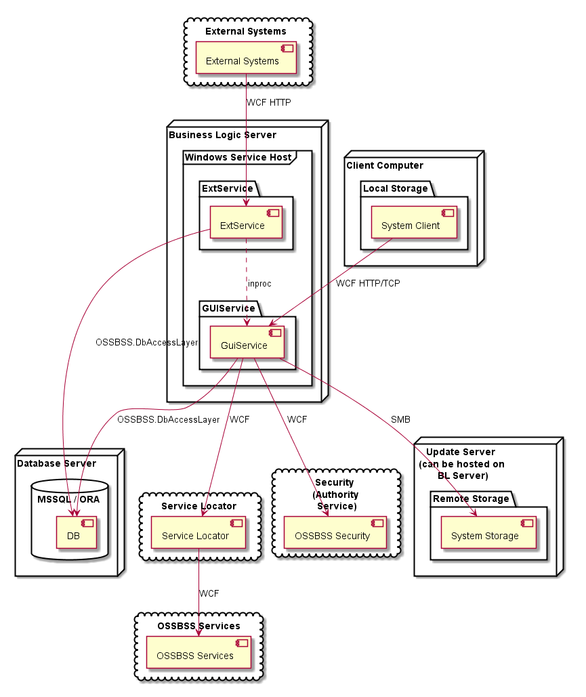
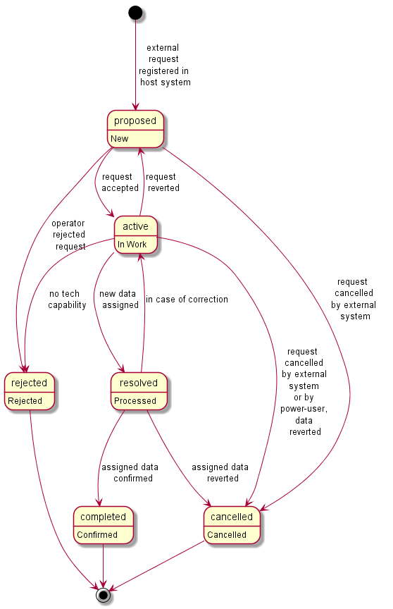

# Plant UML Diagrams

This is a forked version from https://github.com/jvantuyl/sublime_diagram_plugin adding a server dependency
https://github.com/evandrocoan/PlantUmlConnection and rewriting the whole git history removing all the java binary files which have been added,
reducing the repository size from `22.49 MB` to `204 KB`.

This version now first attempts to contact the webserver accordingly to the new settings:
```javascript
    // valid values:
    // 'png'              generate images using PNG format
    // 'svg'              generate images using SVG format
    // 'txt'              generate images with ASCII art
    // 'utxt'             generate images with ASCII art using Unicode characters
    // 'latex'            generate images using LaTeX/Tikz format
    // 'latex:nopreamble' generate images using LaTeX/Tikz format without preamble
    //
    // These formats are also supported by plantUml, but they need some
    // prerequisite to be installed... PlantUml return_code = 1 on invocation:
    // 'pdf' generate images using PDF format
    // 'vdx' generate images using VDX format
    // 'eps' generate images using EPS format
    "output_format": "png",

    // It will first try to use the server, because is much more faster than
    // calling directly the jar. If you would like to run a local server,
    // you can install it from: https://github.com/plantuml/plantuml-server
    "plantuml_server": "http://www.plantuml.com/plantuml/",

    // The full path to the plantuml.jar file
    "jar_file": "C:/Users/plantuml.jar",
```


# Overview

This is a plugin that renders diagrams from your selection in Sublime Text 2
or 3.

By default, it binds the (Command / Alt)-M key and registers a command on the
Command Palette.  Simple select the text for your diagram and trigger the
command.  Multiselections are allowed.  Each diagram will be generated in a
uniquely named file.

If a diagram handler recognizes a diagram in the selection, it will render it
and pop it up in a detected viewer.  Files are rendered into the same directory
as the source file as Portable Network Graphic files.  They will be
automatically overwritten, but not removed.

If you wish to override the viewer used, disable start-time sanity checks, or
change the default character set for diagram files, create a user version of
PlantUmlDiagrams.sublime-settings file in the usual way.

## Install

To install from scratch, it's necessary to have:

* Java (download from java.sun.com)
* Graphviz (I recommend "homebrew" on the Mac)
* Sublime Text 2 or 3

To install, just put a checkout of this project into your Packages directory in
Sublime Text.

- You may already have a PlantUML server in your team,
  find the server address,
  like:
  `http://192.168.1.100:8080/plantuml`.

- If don't have one,
  you can set up on you own ([follow the instructions](https://github.com/plantuml/plantuml-server)).
  Find the server address, like: `http://localhost:8080/plantuml`,
  or `http://192.168.1.100:8080/plantuml` which is ready for sharing to your team.

- Open user setting, and configure like:

```text
"plantuml.server": "http://192.168.1.100:8080/plantuml",
```


## Support

Operating Systems:  MacOS X, Linux, Windows (with default system viewer)
Diagram Types: PlantUML
Viewers (in order of preference):

* MacOS X Preview
* MacOS X QuickLook
* Eye of Gnome

Patches to support additional viewers or diagrams are welcome.

See also:
1. http://plantuml.com/sitemap-language-specification
1. https://github.com/qjebbs/vscode-plantuml
1. https://github.com/plantuml/plantuml-server


## Install Instructions

Check out the source directory or download and uncompress the source tarball.
Put this directory in the Packages directory for your platform.

On Linux, it's sometimes "~/.config/sublime-text-2/Packages/".
On MacOS X, it's "~/Library/Application Support/Sublime Text 2/Packages/".

Sublime Text should detect the plugin and automatically load it.

The source is available via git at:

<https://github.com/jvantuyl/sublime_diagram_plugin.git>

Or as a tarball at:

<https://github.com/jvantuyl/sublime_diagram_plugin/tarball/master>

## Example Results

### Component Diagram 1


### Component Diagram 2


### State Diagram


## Thanks

Special thanks to all of those who have contributed code and feedback,
including:

* Tobias Bielohlawek (Syntax Highlighting Support)
* Julian Godesa (UX Feedback)
* Seán Labastille (Preview Support, Multi-Diagram Support)
* Kirk Strauser (Python 3 / SublimeText 3 Support)
* Stanislav Vitko (PlantUML Updates)
* Constantine ? (Windows Viewer, Charset Support, Various Other Fixes)
* Marcelo Da Cruz Pinto (Windows Viewer)
* Peter Ertel (PEP8 Cleanup, Windows Improvements)
* Juan Cabrera (Version Updates)


## Reverse Engineering

You can use the `pyreverse` plugin from the `pylint` module to generate class diagrams from the code.

```
pip install pylint
pyreverse -o png -p DiagramName python_module_name
```

1. https://www.pylint.org/
1. https://www.logilab.org/blogentry/6883
1. https://pythonhosted.org/theape/documentation/developer/explorations/explore_graphs/explore_pyreverse.html

